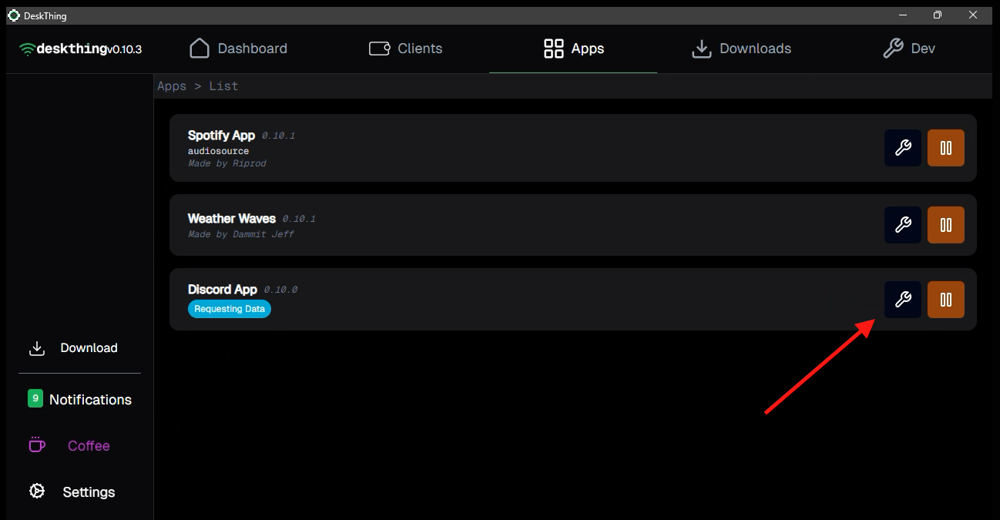
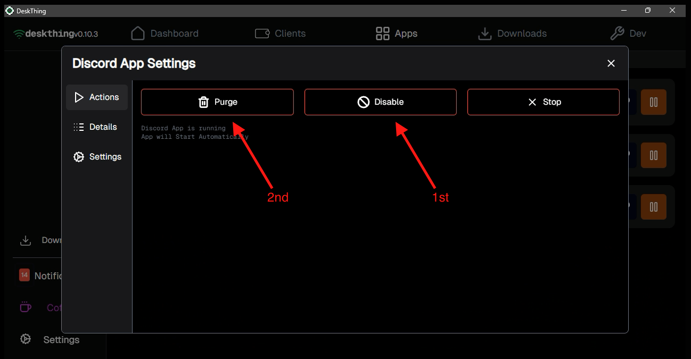
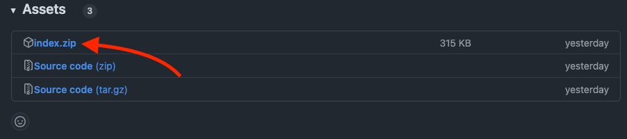
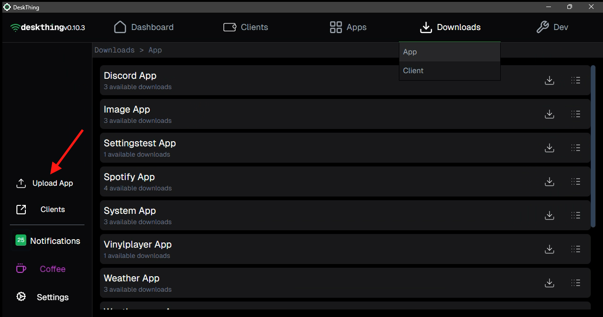

# DiscordThing _for DeskThing_

> _Code by:_ **Ankziety**  _Based on code by:_ **Riprod**

## How to Install on DeskThing

### 1. Disable and Purge Existing Discord App

1. Open the **DeskThing** desktop application
2. Navigate to the **Apps** tab
3. Press the **Settings _(wrench)_** icon next to any existing Discord App
   
4. Navigate to the **Actions** tab; click **Disable** then **Purge**
   

> [!CAUTION]
> It is likely that you will see the following error when purging the application. It is normal and can be safely ignored: <code style="color:red">SERVER: Error clearing cache for directory $PATH_TO_APP_DIR</code>

### 2. Download Latest DiscordThing Version

1. Click the provided link to be taken to the latest release of DiscordThing - [_latest release_](https://github.com/ankziety/DeskThingDiscord/releases/latest)
2. Download the `index.zip` file included on the latest release
   

### 3. Upload and Set Up DiscordThing

1. Navigate to the **Downloads** tab in the **DeskThing** desktop application
2. On the left side click **Upload App**
   
3. Select the `index.zip` that you saved in the previous step
4. Navigate to the **Apps** tab and click **Requesting Information** on the **DiscordThing App** Entry
5. Complete the Discord Developer Team and App Instructions then see [Set Up OAuth Settings](#4-set-up-oauth-settings)

## **How to Make a Discord Developer Team and App**

### 1. Make a Discord Developer Team

1. Open your web browser and go to the Discord Developer Teams page:
   - [Discord Developer Teams](https://discord.com/developers/teams)
2. Log in to your Discord account. If you don’t have one, you’ll need to make one by signing up.
3. Click on **Create Team**. This will open a page where you can give your team a name and fill out some simple details.
4. Type in a name for your team. Pick something that makes sense for what you’re working on.
5. That’s it! Your team is now set up and ready.

---

### 2. Create a New App for Your Team

1. Go to the Discord Developer Applications page:
   - [Discord Developer Applications](https://discord.com/developers/applications)
2. Log in if it asks you to.
3. Click **New Application**. A screen will pop up asking for some information.
4. Enter a name for your app. After that, make sure to choose your team, as the owner, instead of your personal account.
5. Click **Create** to finish setting up the app under your team.

> [!WARNING]
> If you accidentally make an account, that is not your new **team** account, owner of the app you will have to delete it and restart this section.

---

### 3. Add Yourself as a Tester

1. In your app’s settings, look for the **App Testers** section in the menu.
2. Add your Discord account as a tester. Type in your username or ID.
3. Check your email for an invite. Open the email and accept the invitation.
4. Once accepted, your account is now set as a tester for the app.

> [!IMPORTANT]
> You must be an app tester registered with the team application for RPC to connect.

---

### 4. Set Up OAuth Settings

1. Go to the **OAuth2** section in the app’s settings.
2. Find the field for **Redirects** or **Callback URLs**. Add the correct URL here, which should come from the project you’re working on.
3. After setting the redirect, click the option to reset your client secret. This will show you a new secret key.
4. Copy and paste both the **Client ID** and **Client Secret** into your settings.
5. Click **Submit** and restart your discord desktop client

> [!IMPORTANT]
> This app is meant for the desktop client for Discord, if you join a call on your phone or a client that is not the local desktop client it will break things.

---

### Troubleshooting and Support

> [!TIP]
> You can try pausing and unpausing the app in the Developer Portal to restart it. This might fix some bugs.

The easiest way to report bugs and/or make suggestions is by making an issue on this github repo. Please use the proper tags when making issues on the repo so my KanBan will track everything properly - [_make issue_](https://github.com/ankziety/DeskThingDiscord/issues/new/choose)

I also occasionally check the **DeskThing** discord for suggestions, the best place to discuss this App is in this thread - [_DiscordThing Thread_](https://discord.com/channels/1267348109067817051/1327147539308347442)
